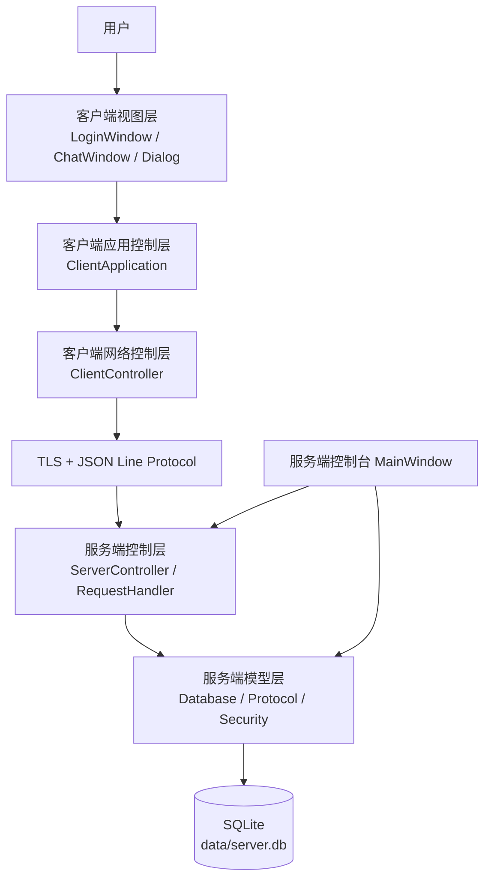
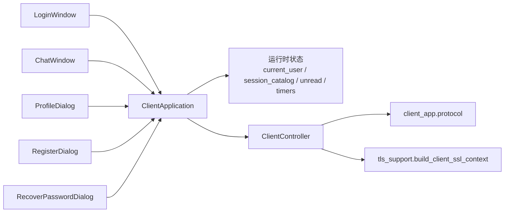
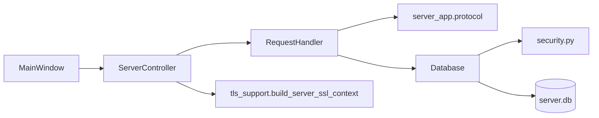
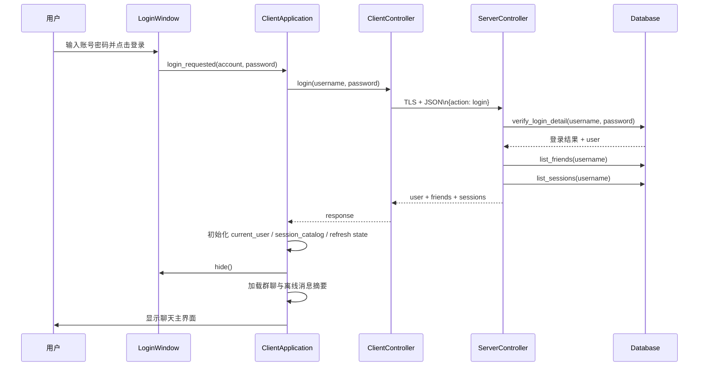
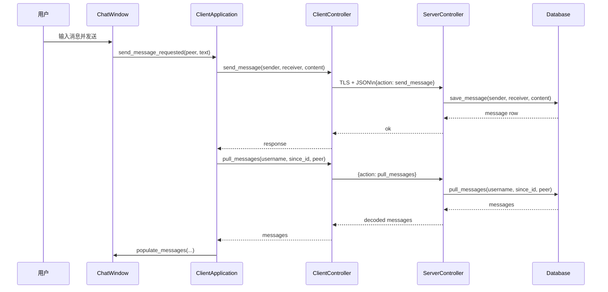
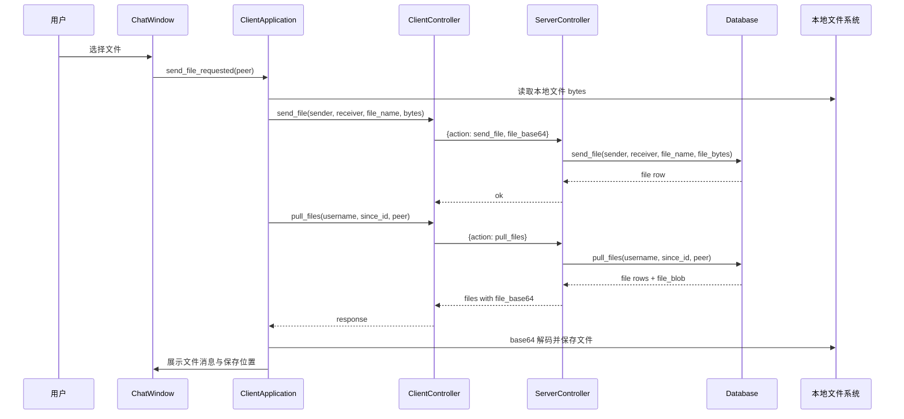
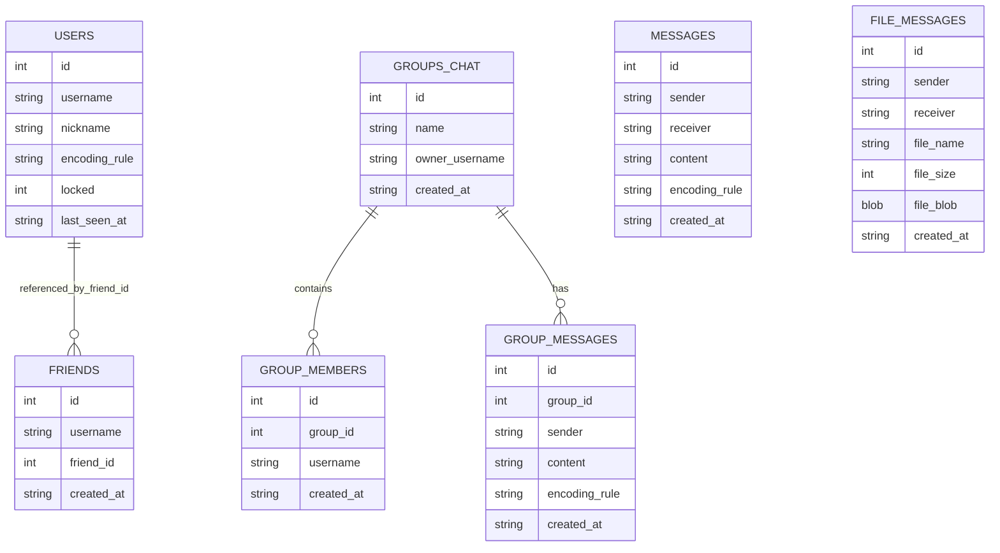

# 安全网络聊天系统架构文档

## 1. 文档目标

本文档用于完整说明该项目的系统架构、模块职责、运行机制、数据流与关键实现路径。阅读完本文档后，应能理解：

- 这个系统由哪些部分组成
- 客户端和服务端如何协作
- 网络请求如何从界面流转到数据库
- 系统如何实现登录、好友、私聊、群聊、文件传输、在线状态与安全机制
- 当前测试覆盖了哪些能力
- 系统当前设计的优点、限制与可演进方向

---

## 2. 系统概览

这是一个基于 Python 的桌面即时通信系统，整体形态是：

- 客户端桌面应用
- 服务端桌面控制台 + 后端服务
- TLS 加密 Socket 通信
- SQLite 本地持久化
- JSON Line Protocol 请求/响应协议

从架构角度看，它不是单纯的 Web 前后端系统，而是一个双桌面端、双进程、长连接、状态型 IM 系统。

核心技术栈：

- Python 3.10+
- PyQt5
- SQLite3
- socket / socketserver / ssl
- unittest

参考：`README.md:25`

---

## 3. 总体架构

### 3.1 总体分层

系统可以拆成 5 层：

1. 客户端视图层
   登录页、聊天页、资料页等 GUI 界面

2. 客户端应用控制层
   负责状态编排、界面跳转、轮询刷新、消息合并、文件落盘

3. 客户端网络控制层
   负责建立 TLS 连接、发送请求、接收响应、错误重试

4. 服务端控制层
   负责监听端口、接受连接、会话认证、按 action 分发业务

5. 服务端模型层
   负责数据库、密码校验、消息持久化、群聊和文件管理

### 3.2 总体结构图

```text
用户
  ↓
客户端 UI
  ↓
ClientApplication
  ↓
ClientController
  ↓
TLS Socket + JSON Line Protocol
  ↓
ServerController / RequestHandler
  ↓
Database / Protocol / Security
  ↓
SQLite (data/server.db)
```

对应关键代码：

- 客户端入口：`client_app/__main__.py:1`、`client_app/app.py:1276`
- 服务端入口：`server_app/__main__.py:1`、`server_app/app.py:13`
- 客户端网络控制器：`client_app/network/client_controller.py:15`
- 服务端控制器：`server_app/network/server_controller.py:49`
- 数据层：`server_app/db.py:79`
- TLS：`tls_support.py:55`

---

## 4. 架构风格说明

### 4.1 双端 MVC

这个项目适合被理解为双侧 MVC + 网络协议层。

### 客户端 MVC

- View
  `LoginWindow`、`ChatWindow`、`ProfileDialog`、`RegisterDialog`、`RecoverPasswordDialog`
  参考：`client_app/ui/login_window.py:161`、`client_app/ui/chat_window.py:31`

- Controller
  `ClientApplication` + `ClientController`
  参考：`client_app/app.py:42`、`client_app/network/client_controller.py:15`

- Model
  客户端没有本地数据库，主要是运行时状态：
  - 当前用户
  - 当前会话
  - 已渲染消息
  - 未读数
  - 文件接收记录
  - 刷新代次与退避状态

  参考：`client_app/app.py:47-83`

### 服务端 MVC

- View
  服务端控制台 `MainWindow`
  参考：`server_app/ui/main_window.py:35`

- Controller
  `ServerController` 及其内部生成的 `RequestHandler`
  参考：`server_app/network/server_controller.py:49`、`server_app/network/server_controller.py:116`

- Model
  `Database` + `security` + `protocol`
  参考：`server_app/db.py:79`、`server_app/security.py:20`、`server_app/protocol.py:8`

---

## 5. 目录与模块职责

### 5.1 客户端模块

#### `client_app/__main__.py`
客户端模块入口，只负责调用 `main()`。
参考：`client_app/__main__.py:1`

#### `client_app/app.py`
客户端应用编排核心。负责：

- 创建窗口和控制器
- 绑定界面信号
- 登录成功后的初始化
- 会话状态维护
- 消息拉取与合并
- 群聊同步
- 文件接收与保存
- 心跳与在线状态刷新
- 失败退避与强制下线处理

核心类：`ClientApplication`
参考：`client_app/app.py:42`

#### `client_app/network/client_controller.py`
客户端网络控制器。负责：

- TLS 连接创建与复用
- 请求序列化发送
- 响应读取与反序列化
- 请求互斥
- 断线重试
- 强制下线通知

参考：`client_app/network/client_controller.py:15`

#### `client_app/protocol.py`
客户端协议编码/解码模块。
参考：`client_app/protocol.py:7`

#### `client_app/ui/`
客户端 UI 组件集合：

- 登录页：`client_app/ui/login_window.py:161`
- 聊天主窗口：`client_app/ui/chat_window.py:31`
- 注册框：`client_app/ui/register_dialog.py:18`
- 资料框：`client_app/ui/profile_dialog.py:16`

### 5.2 服务端模块

#### `server_app/__main__.py`
服务端模块入口。
参考：`server_app/__main__.py:1`

#### `server_app/app.py`
服务端启动编排。负责：

- 创建 `QApplication`
- 初始化数据库目录与数据库文件
- 初始化 schema
- 初始化种子用户
- 打开服务端控制台

参考：`server_app/app.py:13-30`

#### `server_app/network/server_controller.py`
服务端核心控制器。负责：

- 启动/停止 TCP 服务
- 用 TLS 包装 socket
- 为每个连接生成处理器
- 登录会话管理
- 单账号单终端控制
- 请求 action 分发
- 在线用户登记

参考：`server_app/network/server_controller.py:49`

#### `server_app/db.py`
数据库与业务模型核心。负责：

- 表结构初始化
- 用户认证
- 好友关系
- 私聊消息
- 群聊/群成员/群消息
- 文件消息
- 密码找回
- 在线心跳时间记录
- 后台统计

参考：`server_app/db.py:79`

#### `server_app/security.py`
密码安全模块。
参考：`server_app/security.py:20`

#### `server_app/protocol.py`
服务端协议与消息编码模块。
参考：`server_app/protocol.py:8`

#### `server_app/ui/main_window.py`
服务端后台控制台。负责：

- 启动/停止服务
- 展示账号总览
- 展示在线人数、锁定账号、消息总量
- 打开用户管理
- 展示日志

参考：`server_app/ui/main_window.py:35`

---

## 6. 客户端架构详解

### 6.1 客户端启动流程

客户端入口为：

- `client_app/__main__.py:1`
- `client_app/app.py:1276`

启动流程：

1. 设置高 DPI 属性
   `client_app/app.py:1277-1278`

2. 创建 `QApplication`
   `client_app/app.py:1279`

3. 创建 `ClientApplication`
   `client_app/app.py:1280`

4. `ClientApplication` 初始化：
   - 创建 `ClientController`
   - 创建 `LoginWindow`
   - 创建 `ChatWindow`
   - 创建 `QTimer`
   - 绑定所有信号与动作
   参考：`client_app/app.py:47-101`

5. 调用 `start()` 显示登录窗口
   `client_app/app.py:103-105`

### 6.2 客户端应用控制核心：ClientApplication

`ClientApplication` 是客户端真正的应用编排器。

#### 主要职责

##### 1）界面流程控制
- 登录成功后切换到聊天页
  `client_app/app.py:123-177`
- 注销回登录页
  `client_app/app.py:178-185`
- 关闭聊天页时自动走注销流程
  `client_app/app.py:186-188`
- 打开资料框
  `client_app/app.py:223-297`

##### 2）运行时状态管理
它维护了客户端几乎所有重要状态：

- `current_user`
- `active_user_key`
- `active_peer_key`
- `session_catalog`
- `current_rendered_messages`
- `_rendered_message_keys`
- `_received_file_ids`
- `_received_file_paths`
- `last_loaded_message_id`
- `last_loaded_file_id`
- `last_inbox_message_id`
- `last_inbox_file_id`
- `group_last_loaded_message_ids`
- `refresh_generation`
- `message_request_token`
- `presence_request_token`

参考：`client_app/app.py:47-83`

##### 3）定时刷新与轮询
- 基础刷新定时器：`_refresh_timer`
  `client_app/app.py:81-83`
- 定时逻辑入口：`_on_refresh_timer_tick()`
  `client_app/app.py:1028`
- 周期动作包括：
  - 当前会话消息刷新
  - 私聊收件箱增量拉取
  - 在线状态刷新
  - 群消息增量同步

##### 4）数据到 UI 的映射
- 服务端错误码映射成用户提示
  `client_app/app.py:17-39`
- `response -> 视图消息`
  由 `_resolve_user_message()` 统一处理
  `client_app/app.py:107`

### 6.3 客户端 UI 层

#### 6.3.1 登录窗口

`LoginWindow` 负责：

- 账号密码输入
- 发射登录请求
- 打开注册框
- 打开找回密码框
- 展示连接状态和失败提示

关键位置：

- 类定义：`client_app/ui/login_window.py:161`
- 触发登录：`client_app/ui/login_window.py:273`
- 设置状态文本：`client_app/ui/login_window.py:288`
- 设置剩余错误次数警告：`client_app/ui/login_window.py:303`
- 注册对话框：`client_app/ui/login_window.py:318`
- 找回密码对话框：`client_app/ui/login_window.py:341`

#### RecoverPasswordDialog
这是密码找回流程的专用对话框，支持：

- 按账号加载安全问题
- 回答验证
- 输入新密码

参考：`client_app/ui/login_window.py:22`

#### 6.3.2 聊天主窗口

`ChatWindow` 是客户端核心业务视图。
类定义：`client_app/ui/chat_window.py:31`

它对外发出的核心信号：

- `logout_requested`
- `close_requested`
- `profile_requested`
- `search_requested`
- `add_friend_requested`
- `send_message_requested`
- `session_selected`
- `send_file_requested`
- `create_group_requested`
- `download_root_requested`

参考：`client_app/ui/chat_window.py:38-47`

页面结构：

- 聊天页
- 好友页
- 搜索页

参考：`client_app/ui/chat_window.py:206-220`

核心职责：

- 展示当前用户信息
  `client_app/ui/chat_window.py:498`
- 展示好友列表
  `client_app/ui/chat_window.py:507`
- 展示最近会话
  `client_app/ui/chat_window.py:517`
- 展示消息记录
  `client_app/ui/chat_window.py:526`
- 更新单个会话摘要
  `client_app/ui/chat_window.py:543`
- 显示提示信息
  `client_app/ui/chat_window.py:560`

会话切换时，会记录当前会话、更新顶部摘要并发出 `session_selected`。
参考：`client_app/ui/chat_window.py:423-435`

### 6.4 客户端网络控制层

`ClientController` 是同步请求/响应式的长连接控制器。
类定义：`client_app/network/client_controller.py:15`

#### 关键设计点

##### 1）单连接复用
`_ensure_connection()` 会在首次请求时创建 socket 并复用。
参考：`client_app/network/client_controller.py:276-283`

##### 2）TLS 封装
创建连接后使用客户端 SSLContext 包装。
参考：`client_app/network/client_controller.py:278-282`

##### 3）请求互斥
通过 `_request_lock` 防止同一个连接并发发送多条请求。
参考：`client_app/network/client_controller.py:32`、`client_app/network/client_controller.py:285-310`

##### 4）断线自动重试
非登录/注册/找回密码请求，在断线后允许一次重试。
参考：`client_app/network/client_controller.py:320-335`

##### 5）强制下线感知
如果服务端返回 `force_logout`，客户端立即断开本地连接并发出信号。
参考：`client_app/network/client_controller.py:325-328`

#### 对外业务接口
它对上层暴露的不是原始发包，而是业务语义接口，例如：

- `login()` `logout()` `register()`
- `search_users()` `add_friend()` `list_friends()`
- `send_message()` `pull_messages()`
- `create_group()` `list_groups()`
- `send_group_message()` `pull_group_messages()`
- `send_file()` `pull_files()`
- `heartbeat()`
- `get_profile()` `update_profile()`
- `change_password()`
- `set_recovery()` `get_recovery_questions()` `recover_password()`

参考：`client_app/network/client_controller.py:54-274`

---

## 7. 服务端架构详解

### 7.1 服务端启动流程

服务端入口：

- `server_app/__main__.py:1`
- `server_app/app.py:13`

流程：

1. 创建 `QApplication`
   `server_app/app.py:14`

2. 创建数据目录 `data/`
   `server_app/app.py:18-21`

3. 初始化 `Database`
   `server_app/app.py:23`

4. 建表
   `server_app/app.py:24`

5. 注入种子用户
   `server_app/app.py:25`

6. 创建 `MainWindow` 并显示
   `server_app/app.py:27-28`

注意：程序启动后不会自动监听端口，而是由后台控制台按钮触发。
服务真正启动发生在：`server_app/ui/main_window.py:635-650`

### 7.2 服务端控制台 MainWindow

`MainWindow` 是一个运维/教学性质的后台窗口。
参考：`server_app/ui/main_window.py:35`

它负责：

#### 1）服务启停
- 启动：`toggle_start()`
  `server_app/ui/main_window.py:635`
- 停止：同上

#### 2）定时刷新管理面板
- 3 秒刷新一次
  `server_app/ui/main_window.py:56-59`

#### 3）展示系统指标
- 用户总数
- 在线人数
- 锁定人数
- 消息数量
- 群数量
- 文件消息数量

数据来自：
- `Database.get_dashboard_metrics()` `server_app/db.py:284`
- `ServerController.online_usernames()` `server_app/network/server_controller.py:85`

#### 4）展示账号总览
`refresh_dashboard()` 会把数据库用户与在线状态拼接后渲染进表格。
参考：`server_app/ui/main_window.py:488-584`

#### 5）显示运行日志
通过接收 `server_controller.log_signal` 将服务器日志写入文本区。
参考：`server_app/ui/main_window.py:40-41`、`server_app/ui/main_window.py:443-455`

#### 6）关闭时安全停服
`closeEvent()` 会先停止刷新，再停止服务。
参考：`server_app/ui/main_window.py:661-665`

### 7.3 ServerController：服务端控制核心

类定义：`server_app/network/server_controller.py:49`

它的核心职责：

#### 1）服务生命周期管理
- `start(port)` 创建 `ThreadingTCPServer`、启动后台线程
  `server_app/network/server_controller.py:785-796`
- `stop()` 停止服务与关闭 socket
  `server_app/network/server_controller.py:797-807`

#### 2）在线用户表维护
在线用户通过 `username -> handler` 映射保存。
参考：`server_app/network/server_controller.py:58`

相关方法：

- `is_user_online()` `server_app/network/server_controller.py:81`
- `online_usernames()` `server_app/network/server_controller.py:85`
- `_set_online()` `server_app/network/server_controller.py:767`

#### 3）单账号单终端控制
登录新终端时会踢掉旧连接。
参考：`server_app/network/server_controller.py:93-111`

#### 4）为每个连接创建处理器
`_make_handler()` 动态生成 `RequestHandler`。
参考：`server_app/network/server_controller.py:113`

### 7.4 RequestHandler：单连接循环处理器

定义起点：`server_app/network/server_controller.py:116`

工作方式：

#### 1）连接建立
`setup()` 初始化 `current_user`。
参考：`server_app/network/server_controller.py:117-120`

#### 2）循环读取请求
`handle()` 中不断读 `self.rfile.readline()`，说明协议是按行分隔。
参考：`server_app/network/server_controller.py:121-152`

#### 3）协议兼容
- 如果请求以 `{` 开头，则按 JSON 协议处理
  `server_app/network/server_controller.py:134-139`
- 否则走旧版文本协议
  `server_app/network/server_controller.py:140-188`

说明：系统当前主协议是 JSON Line Protocol，但仍保留少量 legacy 兼容。

#### 4）连接结束时清理在线状态
`finish()` 中会在 handler 结束时清理在线用户。
参考：`server_app/network/server_controller.py:154-157`

---

## 8. 请求路由与业务分发

JSON 请求的统一入口是：

- `RequestHandler._handle_json()`
  `server_app/network/server_controller.py:215`

它基于 `action` 做分发，支持的业务包括：

- `login`
- `logout`
- `register`
- `search_users`
- `add_friend`
- `list_friends`
- `send_message`
- `heartbeat`
- `get_profile`
- `update_profile`
- `change_password`
- `set_recovery`
- `get_recovery_questions`
- `recover_password`
- `pull_messages`
- `create_group`
- `list_groups`
- `send_group_message`
- `pull_group_messages`
- `send_file`
- `pull_files`

各 action 的业务实现都落到 `Database`，并通过 `encode_response_line()` 统一输出响应。
参考：

- 响应编码：`server_app/protocol.py:22`
- 路由主体：`server_app/network/server_controller.py:215-763`

---

## 9. 协议设计

### 9.1 协议形式

协议是 JSON 行协议：

- 每个请求是一行 JSON
- 每个响应也是一行 JSON
- 使用 `\n` 分隔帧

客户端发送：`encode_request(payload)`
参考：`client_app/protocol.py:7-8`

服务端接收：`decode_request_line(raw)`
参考：`server_app/protocol.py:8-19`

服务端响应：`encode_response_line()`
参考：`server_app/protocol.py:22-31`

客户端解码：`decode_response(raw)`
参考：`client_app/protocol.py:11-18`

### 9.2 响应统一格式

响应结构固定为：

```json
{
  "ok": true,
  "code": "ok",
  "message": "说明信息",
  "data": {}
}
```

参考：`server_app/protocol.py:25-31`

这让客户端能够统一处理：

- 成功/失败
- 错误码映射
- UI 提示

### 9.3 旧版协议兼容

服务端保留了文本命令兼容：

- `LOGIN username password`
- `LOGOUT username`

参考：`server_app/network/server_controller.py:159-188`

说明该系统经历过从文本协议向 JSON 协议迁移。

---

## 10. 安全架构

### 10.1 传输层安全：TLS

TLS 支撑模块在：`tls_support.py`

主要能力：

#### 1）自动生成开发证书
`ensure_dev_certificates()` 会在 `data/certs` 下生成开发证书。
参考：`tls_support.py:23-52`

#### 2）服务端 SSLContext
`build_server_ssl_context()`
参考：`tls_support.py:55-60`

#### 3）客户端 SSLContext
`build_client_ssl_context()`
参考：`tls_support.py:63-67`

#### 4）最低 TLS 版本
要求 TLS 1.2+
参考：`tls_support.py:58`、`tls_support.py:66`

接入位置：

- 客户端包裹连接：`client_app/network/client_controller.py:278-282`
- 服务端包裹 socket：`server_app/network/server_controller.py:37-46`

### 10.2 密码安全

密码模块：`server_app/security.py`

实现方式：

- 随机盐：`os.urandom`
- `PBKDF2-HMAC-SHA256`
- 迭代次数：120000
- 比对方式：`hmac.compare_digest`

参考：

- 参数：`server_app/security.py:9-11`
- 哈希：`server_app/security.py:20-27`
- 校验：`server_app/security.py:30-34`

应用场景：

- 登录密码
- 密码找回答案

在 `Database` 中通过 `hash_password()` / `verify_password()` 使用。
参考：`server_app/db.py:11`

### 10.3 单终端登录

系统实现了同账号单终端在线。

流程：

1. 新客户端登录
2. 服务端检查在线表
3. 若存在旧 handler，则发送 `force_logout`
4. 新连接覆盖旧连接为当前在线会话

参考：

- 踢旧会话：`server_app/network/server_controller.py:93-111`
- 登录成功时触发：`server_app/network/server_controller.py:218-240`

客户端在收到 `force_logout` 后会：

- 关闭连接
- 触发强制下线信号
- 回到登录页

参考：

- 网络层识别：`client_app/network/client_controller.py:325-328`
- 应用层处理：`client_app/app.py:1082-1088`

### 10.4 登录错误次数限制与锁定

数据库层设置最大尝试次数为 5。
参考：`server_app/db.py:19`

逻辑在 `verify_login_detail()`：

- 密码错误则递增 `failed_attempts`
- 达到上限后锁定账号
- 登录成功后清零失败计数并更新 `last_seen_at`

参考：`server_app/db.py:310-392`

### 10.5 会话有效性校验

很多接口都要求当前 handler 已登录对应用户。

统一校验逻辑：

- `_require_authenticated_user()`
  `server_app/network/server_controller.py:204-213`

如果未登录或会话失效，会返回：

- `not_authenticated`
- 或 `force_logout`

参考：`server_app/network/server_controller.py:190-202`

---

## 11. 数据库架构

数据库核心类：`Database`
参考：`server_app/db.py:79`

### 11.1 连接与事务基础

- 每次业务通过 `connect()` 获取新 SQLite 连接
- `row_factory = sqlite3.Row`
- 开启 `foreign_keys`
- 默认 `journal_mode = WAL`

参考：`server_app/db.py:84-89`

说明：这是一个短连接式 SQLite 访问模型，不是长期共享连接。

### 11.2 核心表结构

建表在 `init_schema()`。
参考：`server_app/db.py:91-177`

#### 1）`users`
字段包括：

- `id`
- `username`
- `nickname`
- `avatar`
- `password_salt`
- `password_hash`
- `recovery_question`
- `recovery_salt`
- `recovery_hash`
- `encoding_rule`
- `locked`
- `failed_attempts`
- `last_seen_at`
- `created_at`
- `updated_at`

参考：`server_app/db.py:95-111`

#### 2）`friends`
好友关系表。
参考：`server_app/db.py:116-126`

#### 3）`messages`
私聊消息表。
参考：`server_app/db.py:128-139`

#### 4）`groups_chat`
群基本信息表。
参考：`server_app/db.py:140-145`

#### 5）`group_members`
群成员关系表。
参考：`server_app/db.py:147-154`

#### 6）`group_messages`
群聊消息表。
参考：`server_app/db.py:156-164`

#### 7）`file_messages`
文件消息表。
参考：`server_app/db.py:166-174`

### 11.3 Schema 兼容升级

`_ensure_schema_compat()` 会在旧库上补列：

- `failed_attempts`
- `last_seen_at`
- `nickname`
- `recovery_question`
- `recovery_salt`
- `recovery_hash`

参考：`server_app/db.py:179-199`

说明系统支持一定程度的数据库平滑升级。

### 11.4 种子数据

服务端启动时若库为空，会创建若干演示账号。
参考：`server_app/db.py:200-228`

---

## 12. 核心业务流

### 12.1 登录流程

#### 流程图

```text
LoginWindow
  -> login_requested(account, password)
  -> ClientApplication.open_chat()
  -> ClientController.login()
  -> TLS request(action=login)
  -> ServerController._handle_json(login)
  -> Database.verify_login_detail()
  -> 返回 user + friends + sessions
  -> ClientApplication 初始化本地状态
  -> ChatWindow 显示主界面
```

关键代码：

- 登录按钮发射：`client_app/ui/login_window.py:273-286`
- 客户端登录编排：`client_app/app.py:123-177`
- 网络请求：`client_app/network/client_controller.py:54-59`
- 服务端登录路由：`server_app/network/server_controller.py:218-249`
- 数据库认证：`server_app/db.py:310-392`

登录成功后的客户端初始化包括：

- 设置 `current_user`
- 记录 `previous_last_seen_at`
- 初始化接收目录
- 重置刷新代次
- 加载好友与会话
- 加载群聊
- 同步离线消息摘要
- 启动聊天页

参考：`client_app/app.py:143-176`

### 12.2 私聊消息流程

#### 发送流程

```text
ChatWindow.send_message_requested
  -> ClientApplication.send_message()
  -> ClientController.send_message()
  -> ServerController.send_message
  -> Database.save_message()
  -> 响应成功
  -> ClientApplication._refresh_messages()
```

关键代码：

- UI 发射：`client_app/ui/chat_window.py:437-446`
- 客户端处理：`client_app/app.py:472-500`
- 网络层：`client_app/network/client_controller.py:109-126`
- 服务端路由：`server_app/network/server_controller.py:376-408`
- 持久化：`server_app/db.py:690-725`

#### 拉取流程

```text
ClientApplication._refresh_messages()
  -> ClientController.pull_messages()
  -> ServerController.pull_messages
  -> Database.pull_messages()
  -> 服务端解码敏感文本
  -> 客户端映射并渲染
```

关键代码：

- 拉取与渲染：`client_app/app.py:640-750`
- 服务端消息拉取：`server_app/network/server_controller.py:582-606`
- 数据库读取：`server_app/db.py:727-746`

### 12.3 群聊流程

#### 创建群聊
- 客户端弹框收集群名和成员
  `client_app/app.py:529-605`
- 调用 `create_group()`
  `client_app/app.py:424-428`
- 服务端落库
  `server_app/network/server_controller.py:608-628`
- 数据层创建群和成员关系
  `server_app/db.py:785-828`

#### 发送群消息
- 客户端识别会话 key 是否以 `[群]` 开头
  `client_app/app.py:477-488`
- 解析群 ID
  `client_app/app.py:1115-1125`
- 走 `send_group_message()`
  `client_app/network/client_controller.py:222-237`
- 服务端校验成员身份后写入 `group_messages`
  `server_app/network/server_controller.py:643-674`
  `server_app/db.py:860-901`

#### 拉取群消息
- 客户端调用 `pull_group_messages()`
  `client_app/app.py:655-660`
- 服务端校验群成员资格
- 返回消息列表

参考：

- 服务端：`server_app/network/server_controller.py:676-709`
- 数据层：`server_app/db.py:903-932`

### 12.4 文件传输流程

#### 发送流程

```text
用户选文件
  -> 本地读取 bytes
  -> base64 编码
  -> send_file 请求
  -> 服务端 base64 解码
  -> SQLite file_messages 保存 blob
```

关键代码：

- 选文件并读取：`client_app/app.py:501-527`
- 客户端 base64 编码：`client_app/network/client_controller.py:251-262`
- 服务端解码并存储：`server_app/network/server_controller.py:711-738`
- 数据库存储：`server_app/db.py:934-965`

#### 接收流程

```text
客户端 pull_files
  -> 服务端从 file_messages 取 blob
  -> 转成 base64 返回
  -> 客户端解码
  -> 用户选择或默认路径保存文件
```

关键代码：

- 服务端返回文件：`server_app/db.py:966-994`
- 客户端拉取：`client_app/app.py:667-724`
- 本地落盘：`client_app/app.py:752-795`

本地接收策略：

- 自动生成默认路径
  `client_app/app.py:801-810`
- 支持用户二次选择保存位置
  `client_app/app.py:812-825`
- 使用 `file_id` 防止重复落盘
  `client_app/app.py:763-795`

### 12.5 好友与搜索流程

#### 搜索用户
- 支持模糊搜索和按 ID 搜索
  `client_app/app.py:436-453`
- 服务端按 mode 调用：
  - `search_users_fuzzy()`
  - `search_user_by_id()`

参考：

- 路由：`server_app/network/server_controller.py:305-325`
- 数据层：`server_app/db.py:607-645`

#### 添加好友
- 传 friend_id
- 数据层双向插入好友关系

参考：

- 客户端：`client_app/app.py:454-470`
- 服务端：`server_app/network/server_controller.py:327-358`
- 数据层：`server_app/db.py:647-675`

### 12.6 个人资料与密码找回

#### 资料修改
- 获取资料：`get_profile`
- 修改昵称：`update_profile`
- 修改密码：`change_password`
- 设置找回信息：`set_recovery`

参考：

- 客户端资料流程：`client_app/app.py:223-297`
- 服务端相关 action：`server_app/network/server_controller.py:430-522`
- 数据层：`server_app/db.py:482-548`

#### 密码找回
- 登录窗口打开找回密码框
- 输入账号后从服务端加载问题
- 回答问题并设置新密码

参考：

- UI：`client_app/ui/login_window.py:22-158`
- 客户端转发：`client_app/app.py:408-422`
- 服务端 action：`server_app/network/server_controller.py:524-580`
- 数据层：`server_app/db.py:549-605`

---

## 13. 在线状态与会话同步机制

### 13.1 在线状态来源

在线状态分两类：

1. 实时在线
   由 `ServerController._online_users` 内存表维护
   参考：`server_app/network/server_controller.py:58`

2. 最近活跃时间
   写入数据库 `users.last_seen_at`
   参考：`server_app/db.py:394-400`

### 13.2 心跳机制

客户端定期调用：

- `heartbeat(username)`
  `client_app/network/client_controller.py:142-143`

服务端收到后：

- 更新 `last_seen_at`
- 若当前 handler 对应用户一致，则刷新在线表

参考：`server_app/network/server_controller.py:410-428`

客户端触发心跳与在线刷新：

- `_refresh_presence()`
  `client_app/app.py:1042-1080`

### 13.3 离线消息识别

客户端登录成功后，会读取：

- `previous_last_seen_at`

参考：`client_app/app.py:148-150`

随后通过 `_is_offline_candidate()` 判断消息/文件是否属于离线期间到达。
参考：`client_app/app.py:388-391`

离线同步入口：

- `_sync_offline_inbox_state()`
  `client_app/app.py:845-921`

它会：

- 扫描私聊消息
- 扫描文件消息
- 扫描群聊消息
- 为对应会话标记未读与离线提示

### 13.4 增量刷新与去重

客户端为了避免重复渲染，设计了两层去重机制：

#### 1）基于 since_id 的增量拉取
- `last_loaded_message_id`
- `last_loaded_file_id`
- `last_inbox_message_id`
- `last_inbox_file_id`
- `group_last_loaded_message_ids`

参考：`client_app/app.py:60-64`

#### 2）基于消息 key 的本地去重
- `_message_key()`
  `client_app/app.py:1183-1191`
- `_merge_rendered_messages()`
  `client_app/app.py:1158-1181`

---

## 14. 并发与线程模型

### 14.1 服务端并发模型

服务端使用：

- `socketserver.ThreadingMixIn`
- 每个连接一个 handler 线程

参考：`server_app/network/server_controller.py:24-26`

即：连接级并发。

特点：

- 多客户端可并发连接
- 每个连接内部是串行处理请求
- 在线用户表访问用锁保护
  `server_app/network/server_controller.py:59`

### 14.2 客户端并发模型

客户端主要依赖：

- Qt 主线程事件循环
- `QTimer` 周期轮询
- 网络调用为同步式
- 同一连接通过 `threading.Lock` 保证单次只处理一个请求

参考：

- 定时器：`client_app/app.py:81-83`
- 请求锁：`client_app/network/client_controller.py:32`
- 忙碌保护：`client_app/network/client_controller.py:285-294`

这意味着客户端并没有实现多请求并发发包，而是通过：

- UI 事件驱动
- 定时轮询
- 连接互斥

来保持状态一致性。

### 14.3 刷新代次与陈旧响应保护

客户端专门实现了陈旧响应丢弃机制：

- `refresh_generation`
- `message_request_token`
- `presence_request_token`

通过：

- `_is_stale_message_response()`
  `client_app/app.py:1243-1258`
- `_is_stale_presence_response()`
  `client_app/app.py:1260-1273`

防止以下问题：

- 切换会话时旧请求回包覆盖新界面
- 注销后旧响应错误更新 UI
- 多轮刷新结果交叉污染

这是客户端状态一致性设计里的关键点。

---

## 15. 敏感文本编码机制

系统支持用户自定义消息编码规则：

- `base64`
- `hex`
- `caesar`

定义：`server_app/db.py:18`

编码/解码逻辑：

- 编码：`server_app/protocol.py:34-45`
- 解码：`server_app/protocol.py:47-56`

存储方式：

消息在数据库中保存的是编码后内容，同时记录 `encoding_rule`。
服务端在 `pull_messages` / `pull_group_messages` 时进行解码后再返回客户端。
参考：

- 私聊解码：`server_app/network/server_controller.py:592-600`
- 群聊解码：`server_app/network/server_controller.py:695-703`

说明：这更接近可配置文本变换，而不是密码学意义上的端到端加密。

---

## 16. 测试架构

### 16.1 集成风格测试

文件：`tests/test_secure_chat_tls_presence.py:21`

该测试覆盖了实际服务端 + 客户端控制器的联动能力，包括：

- TLS 登录
- 在线状态同步
- previous_last_seen_at 返回
- 私聊消息收发
- 登录失败计数与锁定
- 单终端登录踢下线
- 心跳
- 注册必须带找回信息
- 资料更新与密码找回
- 群聊创建与消息往返
- 文件传输往返

例如：

- TLS 登录：`tests/test_secure_chat_tls_presence.py:55`
- 单会话踢下线：`tests/test_secure_chat_tls_presence.py:114`
- 群聊回环：`tests/test_secure_chat_tls_presence.py:201`
- 文件回环：`tests/test_secure_chat_tls_presence.py:230`

### 16.2 客户端逻辑单元测试

文件：`tests/test_client_app_message_mapping.py:106`

主要用 mock 方式验证 `ClientApplication` 的纯逻辑行为，包括：

- 错误码到中文消息的映射
- 增量消息合并
- 文件接收落盘
- 群会话 session key 构造
- 群消息路由
- 未读数处理
- 离线候选判断

例如：

- 错误码映射：`tests/test_client_app_message_mapping.py:130`
- 增量合并：`tests/test_client_app_message_mapping.py:206`
- 文件保存：`tests/test_client_app_message_mapping.py:256`
- 群消息路由：`tests/test_client_app_message_mapping.py:357`

---

## 17. 当前系统的架构特点总结

### 17.1 优点

#### 1）职责边界相对清晰
- UI 不直接访问数据库
- 客户端 UI 不直接做 socket 细节
- 服务端网络层不直接耦合 GUI 页面

#### 2）协议统一
JSON 行协议简单直接，便于调试与扩展。

#### 3）状态管理比较完整
客户端对：

- 增量同步
- 未读计数
- 离线消息
- 群聊会话
- 过期响应

都做了较细致的处理。

#### 4）安全基础到位
- TLS 传输
- PBKDF2 密码哈希
- 单账号单终端
- 登录错误锁定
- 密码找回机制

#### 5）适合教学与课程项目展示
服务端控制台可视化，便于演示系统运行状态。

### 17.2 限制

#### 1）客户端网络仍是同步式
虽然有锁和定时器，但网络调用本质上还是同步请求/响应，复杂场景下 UI 可扩展性一般。

#### 2）SQLite 承载能力有限
适合单机教学、小规模使用，不适合高并发生产场景。

#### 3）文件以 BLOB 存库
`file_messages.file_blob` 直接存二进制，简单但在大文件场景下扩展性有限。
参考：`server_app/db.py:166-174`

#### 4）在线状态依赖内存映射
服务端重启后在线态会丢失，天然是单实例设计。

#### 5）敏感文本编码不等于真正安全加密
当前 `base64/hex/caesar` 是可逆变换，并非现代密码学安全方案。真正安全主要还是依赖 TLS。

---

## 18. 建议的阅读顺序

如果要继续深入源码，建议按以下顺序阅读：

1. `README.md:35`
2. `client_app/app.py:42`
3. `client_app/network/client_controller.py:15`
4. `client_app/ui/chat_window.py:31`
5. `server_app/app.py:13`
6. `server_app/network/server_controller.py:49`
7. `server_app/db.py:91`
8. `server_app/protocol.py:22`
9. `tls_support.py:55`
10. `tests/test_secure_chat_tls_presence.py:21`

---

## 19. 一句话总结

这个系统本质上是一个基于 PyQt5 的桌面即时通信系统，采用客户端应用编排 + TLS 长连接 + 服务端 action 分发 + SQLite 持久化的架构模型；客户端重点在状态同步与界面编排，服务端重点在会话控制、业务分发与本地数据存储，两端通过 JSON 行协议完成协作。

---

## 20. Mermaid 架构图与时序图

### 20.1 总体架构图



### 20.2 客户端内部结构图



### 20.3 服务端内部结构图



### 20.4 登录时序图



### 20.5 私聊消息收发时序图



### 20.6 文件传输时序图



---

## 21. 数据库表清单

数据库初始化入口：`server_app/db.py:91`

### 21.1 `users`

用途：保存用户账号、认证信息、资料信息与安全配置。

主要字段：

- `id`：用户主键
- `username`：登录账号，唯一
- `nickname`：昵称
- `avatar`：头像二进制
- `password_salt`：密码盐值
- `password_hash`：密码哈希
- `recovery_question`：找回问题
- `recovery_salt`：找回答案盐值
- `recovery_hash`：找回答案哈希
- `encoding_rule`：默认消息编码规则
- `locked`：是否锁定
- `failed_attempts`：连续失败次数
- `last_seen_at`：最后活跃时间
- `created_at` / `updated_at`：时间戳

参考：`server_app/db.py:95-111`

### 21.2 `friends`

用途：保存用户与好友的关系映射。

主要字段：

- `id`
- `username`
- `friend_id`
- `created_at`

特点：

- `(username, friend_id)` 唯一
- `friend_id` 关联 `users.id`

参考：`server_app/db.py:116-126`

### 21.3 `messages`

用途：保存私聊消息。

主要字段：

- `id`
- `sender`
- `receiver`
- `content`
- `encoding_rule`
- `created_at`

参考：`server_app/db.py:128-139`

### 21.4 `groups_chat`

用途：保存群聊基本信息。

主要字段：

- `id`
- `name`
- `owner_username`
- `created_at`

参考：`server_app/db.py:140-145`

### 21.5 `group_members`

用途：保存群聊成员关系。

主要字段：

- `id`
- `group_id`
- `username`
- `created_at`

特点：

- `(group_id, username)` 唯一
- `group_id` 关联 `groups_chat.id`

参考：`server_app/db.py:147-154`

### 21.6 `group_messages`

用途：保存群聊消息。

主要字段：

- `id`
- `group_id`
- `sender`
- `content`
- `encoding_rule`
- `created_at`

参考：`server_app/db.py:156-164`

### 21.7 `file_messages`

用途：保存文件消息与文件实体内容。

主要字段：

- `id`
- `sender`
- `receiver`
- `file_name`
- `file_size`
- `file_blob`
- `created_at`

说明：文件内容直接以 BLOB 形式入库。
参考：`server_app/db.py:166-174`

### 21.8 数据库关系简图



---

## 22. 接口清单

服务端 action 分发入口：`server_app/network/server_controller.py:215`

### 22.1 认证与会话接口

| action | 说明 | 关键实现 |
|---|---|---|
| `login` | 登录并返回用户、好友、会话摘要 | `server_app/network/server_controller.py:218` |
| `logout` | 注销当前账号 | `server_app/network/server_controller.py:251` |
| `heartbeat` | 上报心跳并刷新在线状态 | `server_app/network/server_controller.py:410` |

### 22.2 注册与密码找回接口

| action | 说明 | 关键实现 |
|---|---|---|
| `register` | 注册新用户并要求找回信息 | `server_app/network/server_controller.py:265` |
| `set_recovery` | 设置找回问题与答案 | `server_app/network/server_controller.py:502` |
| `get_recovery_questions` | 获取找回问题 | `server_app/network/server_controller.py:524` |
| `get_recovery_question` | 同上，兼容别名 | `server_app/network/server_controller.py:524` |
| `load_recovery_questions` | 同上，兼容别名 | `server_app/network/server_controller.py:524` |
| `recover_password` | 校验找回信息并重置密码 | `server_app/network/server_controller.py:551` |
| `change_password` | 登录态下修改密码 | `server_app/network/server_controller.py:474` |

### 22.3 用户资料与好友接口

| action | 说明 | 关键实现 |
|---|---|---|
| `get_profile` | 获取当前用户资料 | `server_app/network/server_controller.py:430` |
| `update_profile` | 修改昵称等资料 | `server_app/network/server_controller.py:449` |
| `search_users` | 搜索用户，支持模糊与按 ID | `server_app/network/server_controller.py:305` |
| `add_friend` | 添加好友并返回新的好友列表 | `server_app/network/server_controller.py:327` |
| `list_friends` | 获取好友列表 | `server_app/network/server_controller.py:360` |

### 22.4 私聊接口

| action | 说明 | 关键实现 |
|---|---|---|
| `send_message` | 发送私聊消息 | `server_app/network/server_controller.py:376` |
| `pull_messages` | 增量拉取私聊消息 | `server_app/network/server_controller.py:582` |

### 22.5 群聊接口

| action | 说明 | 关键实现 |
|---|---|---|
| `create_group` | 创建群聊并写入成员 | `server_app/network/server_controller.py:608` |
| `list_groups` | 获取当前用户所属群聊 | `server_app/network/server_controller.py:630` |
| `send_group_message` | 发送群聊消息 | `server_app/network/server_controller.py:643` |
| `pull_group_messages` | 增量拉取群聊消息 | `server_app/network/server_controller.py:676` |

### 22.6 文件接口

| action | 说明 | 关键实现 |
|---|---|---|
| `send_file` | 发送文件消息，文件内容为 base64 | `server_app/network/server_controller.py:711` |
| `pull_files` | 增量拉取文件消息 | `server_app/network/server_controller.py:740` |

### 22.7 客户端接口封装对照

客户端对这些 action 做了业务化封装，入口集中在 `ClientController`：

- `login()`：`client_app/network/client_controller.py:54`
- `logout()`：`client_app/network/client_controller.py:61`
- `register()`：`client_app/network/client_controller.py:66`
- `search_users()`：`client_app/network/client_controller.py:81`
- `add_friend()`：`client_app/network/client_controller.py:93`
- `list_friends()`：`client_app/network/client_controller.py:104`
- `send_message()`：`client_app/network/client_controller.py:109`
- `pull_messages()`：`client_app/network/client_controller.py:128`
- `heartbeat()`：`client_app/network/client_controller.py:142`
- `get_profile()`：`client_app/network/client_controller.py:145`
- `update_profile()`：`client_app/network/client_controller.py:148`
- `change_password()`：`client_app/network/client_controller.py:153`
- `set_recovery()`：`client_app/network/client_controller.py:165`
- `get_recovery_questions()`：`client_app/network/client_controller.py:175`
- `recover_password()`：`client_app/network/client_controller.py:194`
- `create_group()`：`client_app/network/client_controller.py:207`
- `list_groups()`：`client_app/network/client_controller.py:219`
- `send_group_message()`：`client_app/network/client_controller.py:222`
- `pull_group_messages()`：`client_app/network/client_controller.py:239`
- `send_file()`：`client_app/network/client_controller.py:251`
- `pull_files()`：`client_app/network/client_controller.py:264`

---

## 23. 推荐补充阅读路径

如果后续还要继续把文档做成正式课程报告，建议再补读以下位置：

- 服务端 UI 仪表盘刷新：`server_app/ui/main_window.py:488`
- 客户端消息刷新主循环：`client_app/app.py:640`
- 客户端在线状态刷新：`client_app/app.py:1042`
- 服务端 action 总入口：`server_app/network/server_controller.py:215`
- 数据库建表与兼容升级：`server_app/db.py:91`
- TLS 证书生成：`tls_support.py:23`
