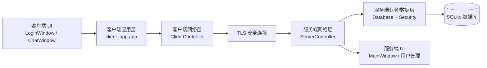
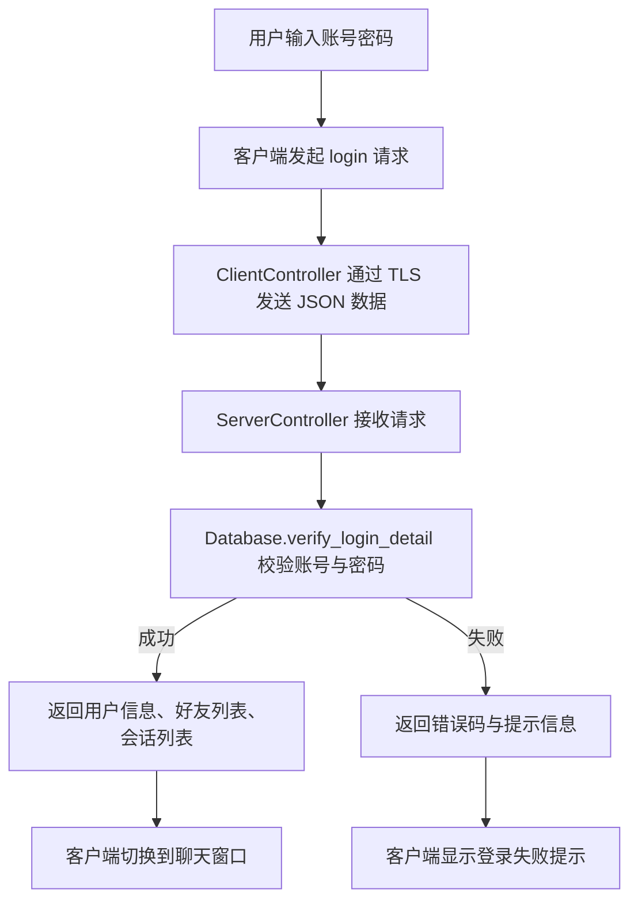
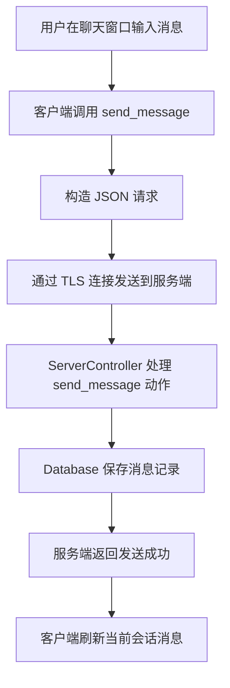
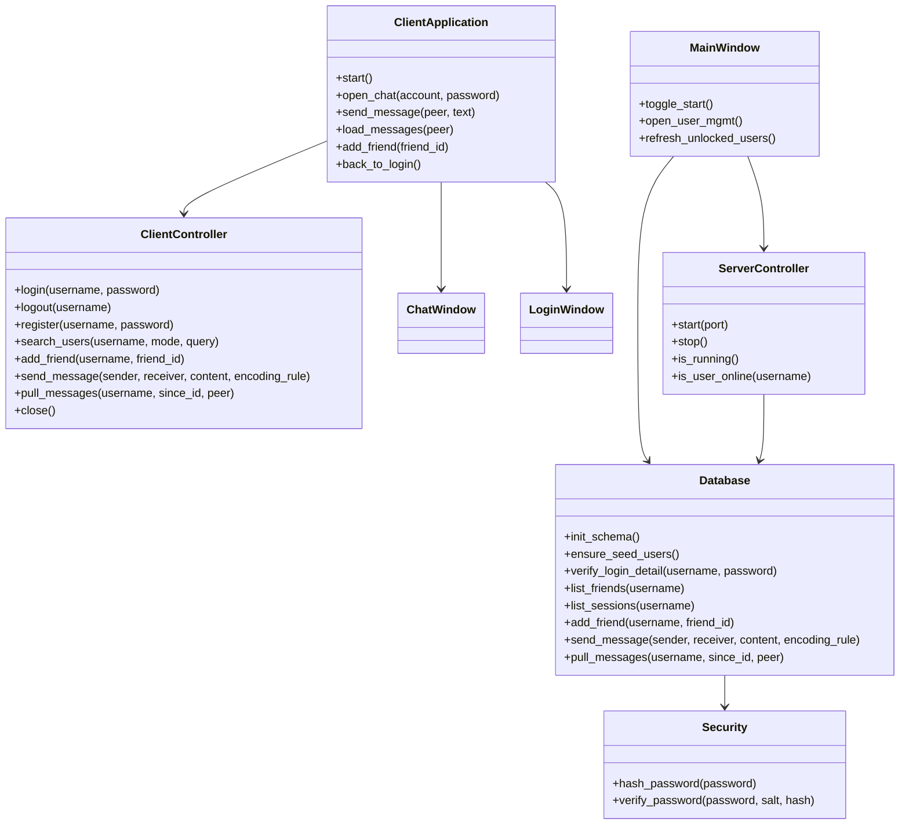
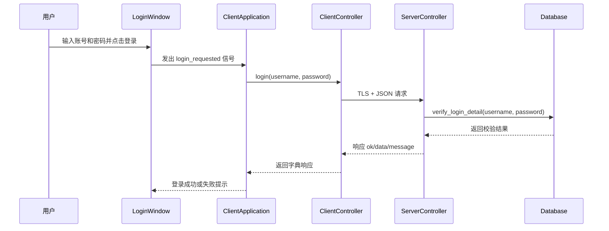

# 安全网络聊天工具（Secure IM Tool）

本项目是一个基于 **Python + PyQt5 + SQLite** 实现的桌面安全聊天系统，包含：

- **服务端管理界面**：用于启动/停止聊天服务器、查看日志、管理用户
- **桌面聊天客户端**：用于登录、注册、好友管理、消息收发
- **本地数据库**：用于保存用户、好友关系、消息记录等数据
- **TLS 安全通信**：客户端与服务端通过 TLS 套接字进行通信

项目当前已经具备一个较完整的课程实验/桌面 IM 原型系统能力，适合作为“网络编程 + 数据库 + GUI + 安全通信”结合的实践项目。

---

## 一、项目特性

### 1. 客户端功能
- 用户登录
- 用户注册
- 好友搜索
- 添加好友
- 最近会话展示
- 私聊消息发送
- 消息拉取与刷新
- 注销返回登录页
- 在线状态展示

### 2. 服务端功能
- 启动/停止 TCP/TLS 聊天服务
- 图形化查看服务日志
- 用户管理（新增、删除、编辑、锁定）
- 头像管理
- 登录认证
- 好友关系管理
- 消息存储与读取
- 在线用户状态维护

### 3. 安全相关能力
- 密码使用 **PBKDF2 + Salt** 哈希存储
- 客户端与服务端之间使用 **TLS** 通信
- 消息内容支持按编码规则进行处理
- 避免明文密码直接落库

---

## 二、技术栈

- **Python 3.10+**
- **PyQt5 5.15.10**
- **SQLite3**
- **socket / socketserver / ssl**
- **unittest**

---

## 三、项目目录结构

```text
SD1/
├─ client_app/                 # 桌面客户端
│  ├─ __main__.py              # 客户端入口
│  ├─ app.py                   # 客户端应用编排层
│  ├─ protocol.py              # 客户端协议编解码
│  ├─ network/
│  │  └─ client_controller.py  # 客户端网络控制器
│  └─ ui/
│     ├─ login_window.py       # 登录窗口
│     ├─ register_dialog.py    # 注册对话框
│     ├─ chat_window.py        # 聊天主窗口
│     └─ theme.py              # 客户端主题样式
│
├─ server_app/                 # 服务端与服务端 UI
│  ├─ __main__.py              # 服务端入口
│  ├─ app.py                   # 服务端应用启动
│  ├─ db.py                    # SQLite 数据层
│  ├─ protocol.py              # 服务端协议编解码
│  ├─ security.py              # 密码哈希与校验
│  ├─ network/
│  │  └─ server_controller.py  # TCP/TLS 服务控制器
│  └─ ui/
│     ├─ main_window.py        # 服务端主窗口
│     ├─ user_management_dialog.py
│     ├─ add_user_dialog.py
│     └─ avatar.py
│
├─ tests/                      # 单元测试
├─ data/                       # SQLite 数据文件目录
├─ tls_support.py              # TLS 证书/上下文辅助模块
├─ requirements.txt            # 项目依赖
└─ README.md                   # 项目说明文档
```

---

## 四、环境要求

- Windows 10 或更高版本
- Python 3.10 及以上

推荐先确认 Python 版本：

```bash
python --version
```

---

## 五、安装依赖

### 方式一：使用清华镜像一次性安装

```bash
python -m pip install -i https://pypi.tuna.tsinghua.edu.cn/simple -r requirements.txt
```

### 方式二：永久配置 pip 镜像后安装

```bash
python -m pip config set global.index-url https://pypi.tuna.tsinghua.edu.cn/simple
python -m pip config set global.trusted-host pypi.tuna.tsinghua.edu.cn
python -m pip install -r requirements.txt
```

### 验证依赖是否安装成功

```bash
python -m pip show PyQt5
```

---

## 六、运行方式

### 1. 启动服务端

```bash
python -m server_app
```

### 2. 启动传统 PyQt5 客户端

```bash
python -m client_app
```

### 3. 启动新客户端 MVP（如果仓库中存在该入口）

```bash
python -m client_app_edifice
```

用于自动化快速验证时，可使用：

```bash
CLIENT_APP_EDIFICE_SMOKE_DELAY=0.1 python -m client_app_edifice
```

---

## 七、测试方式

项目当前使用 **unittest**，不是 pytest。

### 运行全部测试

```bash
python -m unittest discover -s tests -p "test_*.py"
```

### 运行指定测试文件

```bash
python -m unittest tests.test_secure_chat_tls_presence
python -m unittest tests.test_client_app_message_mapping
```

---

## 八、核心功能说明

### 1. 客户端模块说明

#### `client_app/app.py`
客户端应用编排中心，负责：
- 登录后切换窗口
- 保存当前用户状态
- 定时刷新消息和在线状态
- 调用网络控制器收发请求
- 将服务端返回结果映射为用户可读提示

#### `client_app/network/client_controller.py`
客户端网络控制器，负责：
- 建立 TLS 连接
- 发送 JSON 请求
- 接收并解析响应
- 提供登录、注册、搜索、加好友、发送消息、拉取消息等接口

#### `client_app/ui/login_window.py`
负责登录界面展示与输入交互。

#### `client_app/ui/register_dialog.py`
负责注册弹窗与提交逻辑。

#### `client_app/ui/chat_window.py`
负责聊天主界面、会话列表、消息区和交互入口。

---

### 2. 服务端模块说明

#### `server_app/app.py`
服务端应用启动入口，负责：
- 初始化 Qt 应用
- 准备数据库目录与数据库文件
- 初始化表结构与种子数据
- 创建服务端主窗口

#### `server_app/ui/main_window.py`
服务端主界面，负责：
- 启动/停止服务器
- 展示日志
- 设置监听端口
- 打开用户管理窗口

#### `server_app/db.py`
数据库层，负责：
- 用户表维护
- 登录校验
- 好友关系存储
- 消息记录读写
- 用户属性更新

#### `server_app/network/server_controller.py`
服务端网络控制器，负责：
- 启动 TCP/TLS 服务
- 接收客户端请求
- 分发登录、注册、搜索、加好友、发消息、拉消息等动作
- 维护在线用户表

#### `server_app/security.py`
负责密码哈希和密码校验，避免密码明文存储。

---

## 九、系统架构图



---

## 十、登录流程图



---

## 十一、消息发送流程图



---

## 十二、UML 类图



---

## 十三、时序图：登录交互



---

## 十四、数据库说明

### 数据库位置

```text
data/server.db
```

### 主要数据内容
- 用户信息
- 头像信息
- 好友关系
- 消息记录
- 创建时间与更新时间

### 密码存储方式
- 使用带盐 PBKDF2 哈希
- 不以明文形式存储密码

---

## 十五、项目适用场景

本项目适合用于：

- Python 网络编程课程实验
- GUI + 数据库综合课程设计
- 桌面聊天系统原型开发
- TLS 安全通信学习示例
- PyQt5 应用架构练习

---

## 十六、当前实现特点总结

当前仓库相比最初仅有“服务端 UI”的状态，已经扩展为一个更完整的客户端—服务端系统，具备以下特点：

- 客户端与服务端都具备独立入口
- 服务端不仅有界面，还有真实网络处理逻辑
- 客户端已接入登录、聊天、好友等完整交互链路
- 数据层、安全层、协议层职责比较清晰
- 可以继续扩展群聊、文件传输、日志持久化、消息推送等能力

---

## 十七、后续可扩展方向

- 增加群聊功能
- 增加文件传输
- 增加聊天记录搜索
- 增加服务端日志持久化
- 增加更完整的异常恢复与重连策略
- 增加自动化测试覆盖率
- 增加更细粒度的权限控制

---

## 十八、快速开始建议

建议按照以下顺序体验项目：

1. 安装依赖
2. 启动服务端 `python -m server_app`
3. 启动客户端 `python -m client_app`
4. 使用已有用户或新注册用户登录
5. 测试搜索好友、添加好友、发送消息
6. 观察服务端日志和数据库变化

---

## 十九、许可与说明

本项目适合作为课程实验、学习研究和原型验证使用。
如果后续用于正式生产环境，建议进一步完善：

- 身份认证机制
- 异常审计
- 证书管理
- 输入校验
- 持续化日志
- 更严格的安全测试
