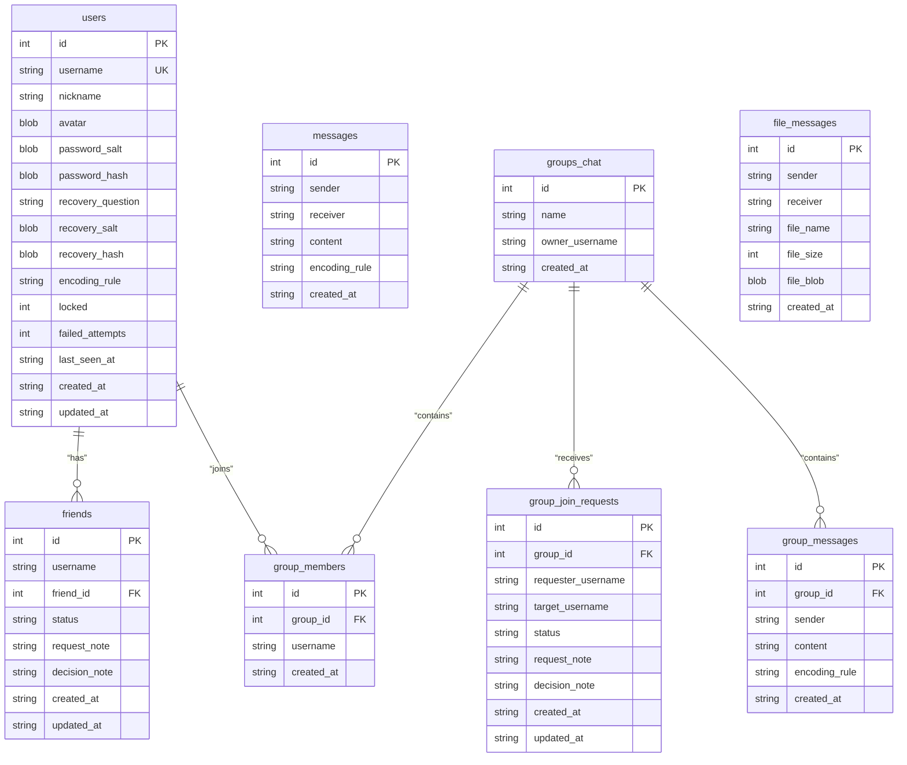
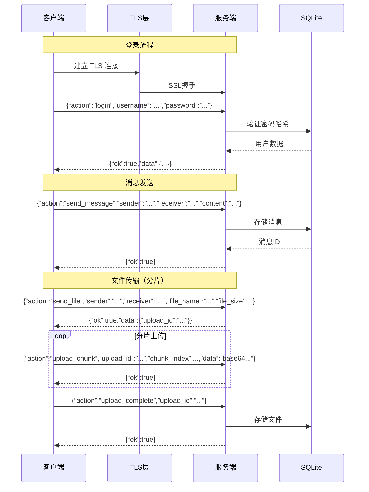

# 安全网络聊天工具（TLS-Message-GUI）

[](https://www.python.org/)
[](https://pypi.org/project/PyQt5/)
[](https://www.sqlite.org/)
[](#)
[](#测试与校验)
[](#快速开始)

基于 Python + PyQt5 + SQLite 的桌面聊天系统，包含客户端、服务端管理界面与 TLS 安全通信。当前版本补齐了好友申请确认、加群审批、分片文件传输与接收目录管理，适合课程实验、功能演示和小规模本地联调。

## 项目概览

- 客户端：登录、注册、好友管理、私聊/群聊、分片文件发送与下载、接收目录选择、个人资料编辑
- 服务端：图形化启动/停止服务、用户管理、在线状态维护、好友申请与加群审批、消息与文件存储
- 协议层：JSON 行协议（保留少量旧版文本协议兼容），大文件走分片上传流程
- 安全能力：密码哈希存储、TLS 传输、单账号单终端会话控制、找回问题重置密码

## 项目演示


## 技术栈

- Python 3.10+
- PyQt5 5.15.10
- SQLite3（标准库）
- socket / socketserver / ssl（标准库）
- unittest（标准库）

依赖文件：requirements.txt

## 系统架构

### 整体架构图

```mermaid
graph TB
    subgraph “客户端应用 (client_app)”
        CUI[“UI 层<br/>login_window.py<br/>chat_window.py<br/>register_dialog.py”]
        CApp[“应用层<br/>app.py”]
        CCtrl[“网络控制器<br/>client_controller.py”]
        CProto[“协议层<br/>protocol.py”]
    end

    subgraph “服务端应用 (server_app)”
        SUI[“UI 层<br/>main_window.py<br/>user_management_dialog.py”]
        SApp[“应用层<br/>app.py”]
        SCtrl[“网络控制器<br/>server_controller.py”]
        SProto[“协议层<br/>protocol.py”]
        SDB[“数据层<br/>db.py”]
        SSec[“安全模块<br/>security.py”]
    end

    subgraph “基础设施”
        TLS[“TLS 支持<br/>tls_support.py”]
        DB[(“SQLite<br/>server.db”)]
    end

    CUI --> CApp
    CApp --> CCtrl
    CCtrl --> CProto
    CProto -->|”TLS + JSON”| TLS
    TLS -->|”加密传输”| SProto
    SProto --> SCtrl
    SCtrl --> SApp
    SApp --> SUI
    SCtrl --> SDB
    SDB --> SSec
    SDB --> DB
```

### 数据库 ER 图


```mermaid
erDiagram
    users {
        int id PK
        string username UK
        string nickname
        blob avatar
        blob password_salt
        blob password_hash
        string recovery_question
        blob recovery_salt
        blob recovery_hash
        string encoding_rule
        int locked
        int failed_attempts
        string last_seen_at
        string created_at
        string updated_at
    }

    friends {
        int id PK
        string username
        int friend_id FK
        string status
        string request_note
        string decision_note
        string created_at
        string updated_at
    }

    messages {
        int id PK
        string sender
        string receiver
        string content
        string encoding_rule
        string created_at
    }

    groups_chat {
        int id PK
        string name
        string owner_username
        string created_at
    }

    group_members {
        int id PK
        int group_id FK
        string username
        string created_at
    }

    group_messages {
        int id PK
        int group_id FK
        string sender
        string content
        string encoding_rule
        string created_at
    }

    group_join_requests {
        int id PK
        int group_id FK
        string requester_username
        string target_username
        string status
        string request_note
        string decision_note
        string created_at
        string updated_at
    }

    file_messages {
        int id PK
        string sender
        string receiver
        string file_name
        int file_size
        blob file_blob
        string created_at
    }

    users ||--o{ friends : “has”
    users ||--o{ group_members : “joins”
    groups_chat ||--o{ group_members : “contains”
    groups_chat ||--o{ group_join_requests : “receives”
    groups_chat ||--o{ group_messages : “contains”
```

### 通信时序图


```mermaid
sequenceDiagram
    participant C as 客户端
    participant TLS as TLS层
    participant S as 服务端
    participant DB as SQLite

    Note over C,S: 登录流程
    C->>TLS: 建立 TLS 连接
    TLS->>S: SSL握手
    C->>S: {“action”:”login”,”username”:”...”,”password”:”...”}
    S->>DB: 验证密码哈希
    DB-->>S: 用户数据
    S-->>C: {“ok”:true,”data”:{...}}

    Note over C,S: 消息发送
    C->>S: {“action”:”send_message”,”sender”:”...”,”receiver”:”...”,”content”:”...”}
    S->>DB: 存储消息
    DB-->>S: 消息ID
    S-->>C: {“ok”:true}

    Note over C,S: 文件传输（分片）
    C->>S: {“action”:”send_file”,”sender”:”...”,”receiver”:”...”,”file_name”:”...”,”file_size”:...}
    S-->>C: {“ok”:true,”data”:{“upload_id”:”...”}}
    loop 分片上传
        C->>S: {“action”:”upload_chunk”,”upload_id”:”...”,”chunk_index”:...,”data”:”base64...”}
        S-->>C: {“ok”:true}
    end
    C->>S: {“action”:”upload_complete”,”upload_id”:”...”}
    S->>DB: 存储文件
    S-->>C: {“ok”:true}
```

### 核心特点

- **同步请求-响应模型**：客户端发送请求，等待服务端响应
- **Action 分发机制**：服务端按 `action` 字段路由到对应处理逻辑
- **线程池并发**：`ThreadingTCPServer` 处理多客户端并发连接
- **信号槽通信**：PyQt5 信号槽实现 UI 与网络层解耦
- **分片文件传输**：大文件分片上传，支持进度跟踪

## 代码实现现状

### 客户端模块 (client_app)

| 模块 | 文件 | 职责 |
|-----|------|-----|
| **应用层** | `app.py` | 窗口管理、登录状态维护、全局热键 |
| **协议层** | `protocol.py` | JSON 编解码、请求/响应格式化 |
| **网络层** | `network/client_controller.py` | TCP 连接管理、请求发送、信号发射 |
| **UI 层** | `ui/login_window.py` | 登录/注册界面 |
| | `ui/chat_window.py` | 聊天主界面、消息列表、文件管理 |
| | `ui/register_dialog.py` | 注册对话框 |
| | `ui/profile_dialog.py` | 个人资料编辑 |
| | `ui/theme.py` | 仿微信风格主题配置 |

### 服务端模块 (server_app)

| 模块 | 文件 | 职责 |
|-----|------|-----|
| **应用层** | `app.py` | 服务生命周期管理 |
| **协议层** | `protocol.py` | 请求解码、响应编码、敏感文本编解码 |
| **网络层** | `network/server_controller.py` | TCP 监听、连接处理、在线状态管理 |
| **数据层** | `db.py` | SQLite 操作、Schema 管理、业务查询 |
| **安全层** | `security.py` | PBKDF2 密码哈希、盐值生成 |
| **UI 层** | `ui/main_window.py` | 服务器主界面 |
| | `ui/user_management_dialog.py` | 用户管理对话框 |
| | `ui/add_user_dialog.py` | 添加用户对话框 |
| | `ui/avatar.py` | 头像处理 |
| | `ui/theme.py` | 服务端主题配置 |

### 关键类说明

**ClientController** (`client_app/network/client_controller.py`)
- 管理与服务端的 TLS 连接
- 提供异步请求方法（login、register、search_users 等）
- 通过 PyQt5 信号（login_finished、message_sent 等）通知 UI 层
- 文件分片上传支持（FILE_CHUNK_SIZE = 256KB）

**ServerController** (`server_app/network/server_controller.py`)
- 继承 `QObject`，发射日志信号
- `ThreadingTCPServer` 实现多线程并发处理
- 在线用户管理（`_online_users` 字典）
- 单账号单终端会话控制（踢下线机制）

**Database** (`server_app/db.py`)
- SQLite WAL 模式，支持并发读写
- 自动 Schema 迁移（`_ensure_schema_compat`）
- 8 张核心表：users、friends、messages、groups_chat、group_members、group_messages、group_join_requests、file_messages
- 密码使用 PBKDF2 + 随机盐值哈希存储

### 协议格式

**请求格式** (客户端 -> 服务端)
```json
{
  "action": "login|register|send_message|...",
  "username": "...",
  "password": "...",
  // 其他业务字段
}
```

**响应格式** (服务端 -> 客户端)
```json
{
  "ok": true|false,
  "code": "SUCCESS|ERROR_CODE",
  "message": "描述信息",
  "data": { ... }
}
```

### 已实现的 Action 列表

| Action | 说明 |
|--------|------|
| `login` | 用户登录 |
| `register` | 用户注册 |
| `logout` | 用户登出 |
| `search_users` | 搜索用户 |
| `add_friend` | 发送好友申请 |
| `respond_friend` | 同意/拒绝好友申请 |
| `list_friends` | 获取好友列表 |
| `send_message` | 发送私聊消息 |
| `fetch_messages` | 拉取历史消息 |
| `create_group` | 创建群聊 |
| `invite_to_group` | 邀请加入群聊 |
| `respond_group_invite` | 同意/拒绝群聊邀请 |
| `list_groups` | 获取群聊列表 |
| `send_group_message` | 发送群消息 |
| `fetch_group_messages` | 拉取群消息 |
| `send_file` | 发起文件传输 |
| `upload_chunk` | 上传文件分片 |
| `upload_complete` | 完成文件上传 |
| `list_files` | 获取文件列表 |
| `download_file` | 下载文件 |
| `update_profile` | 更新个人资料 |

### 安全机制

| 机制 | 实现 |
|------|------|
| **传输加密** | TLS 1.2+，自签名证书自动管理 |
| **密码存储** | PBKDF2 + 随机盐值（16字节） |
| **会话控制** | 单账号单终端，新登录踢下旧会话 |
| **敏感文本** | 可选 base64/hex/caesar 编码链 |
| **登录保护** | 失败次数限制（MAX_LOGIN_ATTEMPTS = 5） |

## 快速开始

### 1. 环境准备

- Windows 10/11（推荐）
- Python 3.10 或更高版本

检查 Python 版本：

```powershell
python --version
```

### 2. 安装依赖

```powershell
python -m pip install -r requirements.txt
```

### 3. 启动服务端

```powershell
python -m server_app
```

### 4. 启动客户端

```powershell
python -m client_app
```

## 项目结构

```text
SD1/
├─ client_app/              # 客户端应用（UI + 应用编排 + 网络控制）
├─ server_app/              # 服务端应用（UI + 网络服务 + 数据层）
├─ tests/                   # unittest 测试
├─ plans/                   # 实施计划与对齐文档
├─ doc/ / docs/             # 项目说明、答辩与技术文档
├─ data/                    # SQLite 数据文件目录
├─ downloads/received/      # 客户端默认接收文件目录
├─ tls_support.py           # TLS 证书与上下文辅助
└─ requirements.txt
```

## 关键功能

- 账号体系：登录、注册、锁定控制、找回问题重置密码
- 社交能力：搜索用户、好友申请、好友同意/拒绝、会话列表
- 聊天能力：私聊消息拉取、群聊创建、邀请审批、群消息拉取
- 文件能力：分片上传、大文件发送、文件拉取、客户端下载目录管理、发送进度提示
- 在线状态：登录在线、离线时间、会话状态刷新
- 安全能力：PBKDF2 + Salt 密码存储、TLS 通信、单端登录挤下线

## 当前版本补充

- 好友申请需要对方明确同意，未成为好友前不能直接私聊或发送文件
- 创建群聊后，受邀成员会先收到加群申请，通过后才正式加入
- 文件发送改为后台分片上传，界面会显示进度，较大的文件也能稳定传输
- 客户端可以单独设置接收目录，收到的文件会按用户关系落到本地目录中

## 开发流程（建议）

1. 在 plans/ 下先补一份需求或变更计划
2. 在 client_app 或 server_app 完成功能实现
3. 先做语法校验，再跑对应测试
4. 自查文案与错误码映射，确保客户端提示可读

## 编码约定（摘要）

- 新模块默认包含 `from __future__ import annotations`（延迟注解）
- 导入顺序：标准库 -> 第三方 -> 本地模块
- 命名规则：类用 PascalCase，函数/变量用 snake_case
- 网络错误优先返回结构化响应，不直接让处理线程崩溃
- 保持现有同步通信模型，不随意改成服务端主动推送

## 测试与校验

运行全量测试：

```powershell
python -m unittest discover -s tests -p "test_*.py"
```

按影响范围运行重点测试：

```powershell
python -m unittest tests.test_secure_chat_tls_presence
python -m unittest tests.test_client_app_message_mapping
python -m unittest tests.test_client_controller_file_upload
```

语法校验示例：

```powershell
python -m py_compile "client_app/app.py" "client_app/network/client_controller.py" "client_app/ui/chat_window.py" "server_app/db.py" "server_app/network/server_controller.py" "tls_support.py"
```

## 贡献说明

- 先阅读 AGENTS.md，遵守仓库约定
- 尽量做“小步可验证”提交，避免一次性大改协议或数据库结构
- 涉及网络协议、数据库表结构、通信模型的重大调整，请先达成共识
- 严禁提交密钥、令牌、`.env`（环境变量文件）等敏感信息

## 许可证

当前仓库未提供明确 License 文件。如需开源分发，请先补充 LICENSE。
