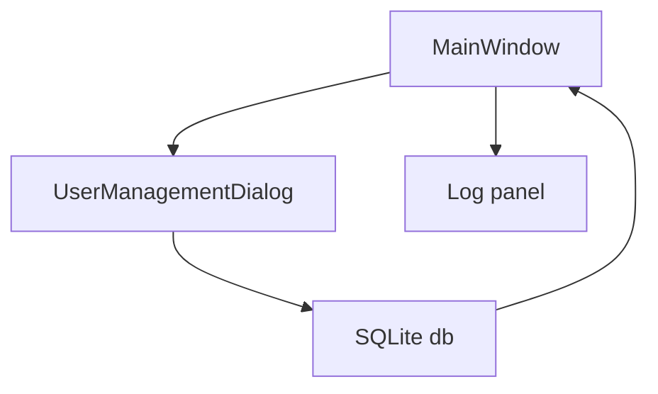

# Experiment 1 Plan: Secure IM Tool - Server UI (PyQt5 + SQLite)

## 0. Scope (confirmed)
- Experiment 1 delivers **Server UI + SQLite persistence only**.
- Toolbar Start button is a **stub**: toggles status, disables/enables port selector, writes logs.
- Main avatar list shows **all unlocked users** from SQLite, ordered by `created_at` then `id`.
- User management supports **inline editing** for `username`, `password`, `encoding_rule`, `locked`, with immediate DB save.

## 1. Target Screens (mapping)
- Main window: matches `主界面.png`.
- User management dialog: matches `用户管理.png`.

## 2. SQLite schema (single file DB)
DB file: `data/server.db`

Table: `users`
- `id` INTEGER PRIMARY KEY AUTOINCREMENT
- `username` TEXT NOT NULL UNIQUE
- `avatar` BLOB NULL
- `password_salt` BLOB NOT NULL
- `password_hash` BLOB NOT NULL
- `encoding_rule` TEXT NOT NULL DEFAULT '[]'  
  JSON array like `[base64, hex, caesar]`
- `locked` INTEGER NOT NULL DEFAULT 0  
  0 or 1
- `created_at` TEXT NOT NULL  
  ISO string `YYYY-MM-DD HH:MM:SS`
- `updated_at` TEXT NOT NULL

Indexes
- `idx_users_locked` on `locked`
- `idx_users_created_at` on `created_at`

Notes
- Password column in UI is editable, but DB stores only salted hash.
- When displaying, password cell shows placeholder like `******`.

## 3. Project structure (proposed)
Package: `server_app/`
- `server_app/__main__.py` entrypoint
- `server_app/app.py` QApplication wiring
- `server_app/db.py` sqlite init + CRUD
- `server_app/security.py` password hashing helpers
- `server_app/ui_main_window.py` MainWindow
- `server_app/ui_user_mgmt.py` UserManagementDialog
- `server_app/ui_add_user.py` AddUserDialog
- `server_app/widgets.py` small custom widgets (optional)

Data
- `data/server.db`

## 4. UI specification

### 4.1 MainWindow (like `主界面.png`)
Top toolbar
- Action: `用户管理`
- Label: `监听端口:`
- `QSpinBox` range 1-65535, default 8000
- Start toggle button with play icon

Central area (vertical)
- Upper panel: online list (actually unlocked users)
  - `QListWidget` in IconMode
  - each item shows avatar icon + username
  - locked users excluded
- Lower panel: log console
  - `QPlainTextEdit` read-only

Behavior
- Start click: toggles running state, logs `Server started on port ...` or `Server stopped`.
- When DB changes (add/edit/lock/avatar), refresh the unlocked list.

### 4.2 UserManagementDialog (like `用户管理.png`)
Layout
- Left: table
- Right: vertical buttons: Add, Delete, Exit

Table columns (in order)
1. 用户ID (read-only)
2. 用户名 (editable)
3. 头像 (double-click to change; shows thumbnail)
4. 密码 (editable; shows `******`)
5. 编码规则 (editable string, user edits like `base64,hex`)
6. 锁定 (checkbox)
7. 创建时间 (read-only)

Inline edit rules
- On cell edit/checkbox toggle, validate then update SQLite immediately.
- Prevent infinite signals: use signal blocker while populating.

Add user flow
- Modal dialog fields
  - username
  - password
  - avatar file chooser
  - encoding rule multi-select: Base64, Hex, Caesar
  - locked checkbox
- On save: hash password with salt, insert row.

Delete flow
- Deletes selected row after confirm.

## 5. Encoding rule UX + storage
- UI stores and displays as comma separated, case-insensitive.
- Accepted tokens: `base64`, `hex`, `caesar`.
- Stored as JSON text array.

## 6. Avatar handling
- Stored as SQLite BLOB (raw image bytes).
- Import: select image file, read bytes.
- Rendering: load QPixmap from bytes, scale to a fixed size.
- If missing: use a generated placeholder pixmap.

## 7. Logging
- Use one helper `append_log(msg)` in MainWindow.
- Log includes timestamp prefix.
- Optional: also write to `data/server.log` (can be added later).

## 8. Data flows (high level)

## 9. Acceptance criteria
- Launches without errors on Windows + Python 3.10 + PyQt5 5.15.
- MainWindow shows toolbar with port selector default 8000 and Start stub.
- MainWindow avatar list shows unlocked users from DB with icons.
- UserManagementDialog shows table with the listed columns.
- Add/Delete works and persists in SQLite.
- Inline edit on username/password/encoding/locked saves immediately.
- Password is stored salted-hash in DB (no plaintext), while UI shows placeholder.

## 10. Implementation checklist for Code mode
1. Create package skeleton + entrypoint.
2. Implement `db` init + schema creation.
3. Implement `security` PBKDF2 hashing + verify helper.
4. Implement MainWindow UI + log helper + refresh user list.
5. Implement UserManagementDialog with QTableWidget + load from DB.
6. Implement AddUserDialog.
7. Wire signals: add, delete, inline edit, avatar update.
8. Add minimal seed users (optional) for demo.
9. Add README with install/run instructions.
